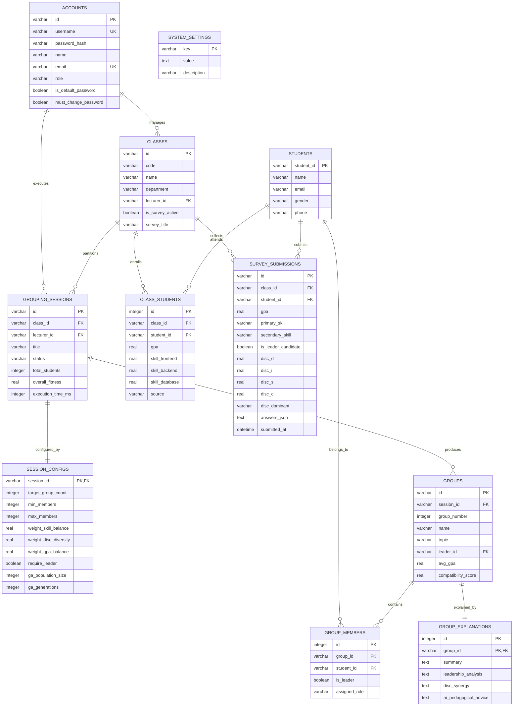
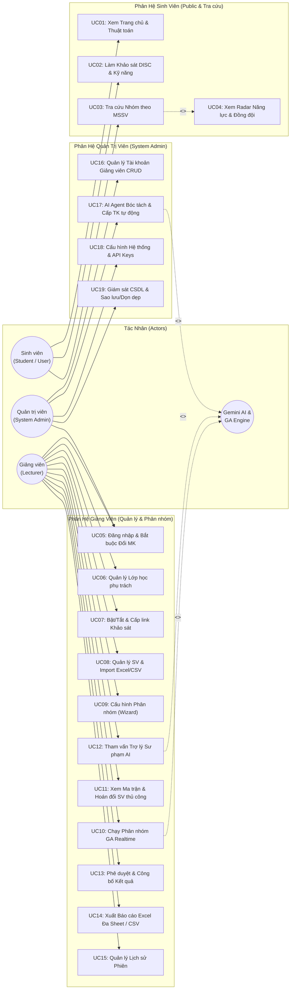

# Kế Hoạch Triển Khai: Cơ Sở Dữ Liệu & Sơ Đồ Use Case Hệ Thống NOVIARA

Hệ thống **NOVIARA** đã hoàn thiện trang **Khảo sát Năng lực & Trắc nghiệm DISC** (`StudentSurvey.tsx`) và **Quản lý Lớp học** (`LecturerClasses.tsx`), tuy nhiên dữ liệu hiện đang lưu trữ tạm thời tại `localStorage` ở Client-side. Tài liệu này cung cấp phân tích chuyên sâu, bản thiết kế chi tiết 11 bảng Cơ sở dữ liệu quan hệ (SQLite/3NF) và tái cấu trúc toàn diện Sơ đồ Use Case phân tầng theo chuẩn đồ án chuyên ngành CNTT.

---

## 1. Phân Tích Chuyên Sâu Kiến Trúc & Điểm Nghẽn Hiện Tại

```mermaid
flowchart TD
    subgraph CurrentClientOnly["Kiến trúc Hiện Tại (Client-side Only - Cần Khắc Phục)"]
        SV["Sinh viên (Thiết bị A)<br>Làm khảo sát"] -->|Ghi vào| LS1["localStorage Trình duyệt A<br>(Isolated)"]
        GV["Giảng viên (Thiết bị B)<br>Vào xem lớp"] -->|Đọc từ| LS2["localStorage Trình duyệt B<br>(Isolated - Trống rỗng)"]
        LS1 -.->|KHÔNG ĐỒNG BỘ ĐƯỢC| LS2
    end

    subgraph ProposedServerDB["Kiến trúc Mục Tiêu (Centralized SQLite Database)"]
        SV2["Sinh viên (Mobile/PC)"] -->|POST /api/surveys/submit| API["FastAPI Backend<br>(REST API & SSE)"]
        GV2["Giảng viên (Laptop)"] -->|GET /api/classes/{id}/submissions| API
        ADM2["Quản trị viên"] -->|GET /api/system/analytics| API
        API -->|ORM / SQL Transaction| DB[("SQLite Database<br>(NOVIARA.db)")]
        DB -->|Feed dữ liệu khảo sát| GA["Lõi Genetic Algorithm Engine"]
    end
```

### 1.1. Các Hạn Chế Khi Lưu Trữ Tại `localStorage`

1. **Cô lập dữ liệu (Data Silo)**: Sinh viên nộp bài khảo sát từ điện thoại hoặc máy tính cá nhân thì dữ liệu chỉ nằm trong `localStorage` của trình duyệt đó. Giảng viên mở máy tính ở trường sẽ **hoàn toàn không thấy sinh viên nào đã nộp**.
2. **Dễ mất dữ liệu**: Khi sinh viên hoặc giảng viên xóa lịch sử duyệt web (Clear Cache/Storage) hoặc mở trình duyệt ẩn danh (Incognito), toàn bộ danh sách lớp và bài nộp khảo sát sẽ biến mất vĩnh viễn.
3. **Không đảm bảo toàn vẹn dữ liệu (Referential Integrity)**: Không có ràng buộc khóa ngoại (Foreign Key). Nếu xóa một lớp học, các bài khảo sát của lớp đó trở thành dữ liệu rác (orphan data).
4. **Không hỗ trợ truy vấn thống kê**: Không thể thực hiện các câu truy vấn phức tạp (SQL Aggregate, JOIN, Filter theo điểm DISC, xếp hạng GPA) để cung cấp trực tiếp cho giải thuật di truyền (GA).

---

## 2. Thiết Kế Cơ Sở Dữ Liệu Quan Hệ (11 Bảng Chuẩn 3NF)

Hệ thống sử dụng **SQLite** (tệp `backend/data/NOVIARA.db`), tuân thủ chuẩn báo cáo đồ án, không đòi hỏi cài đặt server CSDL cồng kềnh, dễ dàng đóng gói và di chuyển.

### 2.1. Sơ Đồ Thực Thể - Quan Hệ (ERD Diagram)



### 2.2. Chi Tiết Danh Mục 11 Bảng CSDL

1. **`accounts`**: Lưu trữ tài khoản Quản trị viên và Giảng viên. Hỗ trợ xác thực mật khẩu, kiểm tra đổi mật khẩu lần đầu và phân quyền vai trò.
2. **`classes`**: Lưu trữ các lớp học/học phần. Chứa cờ `is_survey_active` điều khiển việc mở/đóng nhận bài khảo sát của sinh viên.
3. **`students`**: Danh bạ hồ sơ sinh viên định danh theo Mã số sinh viên (MSSV).
4. **`class_students`**: Bảng quan hệ sinh viên tham gia lớp học nào, lưu điểm GPA và điểm kỹ năng nạp từ file Excel/CSV danh sách lớp.
5. **`survey_submissions`**: Lưu trữ bài khảo sát chi tiết của sinh viên (điểm 4 trục DISC, dominant/secondary style, nguyện vọng làm leader, câu trả lời trắc nghiệm dạng JSON).
6. **`grouping_sessions`**: Lịch sử các phiên chạy phân nhóm GA, lưu trạng thái (draft, running, completed, published), chỉ số Fitness tổng quát và thời gian thực thi.
7. **`session_configs`**: Bộ tham số thuật toán riêng của từng phiên (số nhóm K, các trọng số hàm thích nghi, ràng buộc cứng/mềm, siêu tham số GA).
8. **`groups`**: Danh sách các nhóm sinh viên thành phẩm sinh ra từ phiên phân nhóm.
9. **`group_members`**: Bảng phân công chi tiết sinh viên vào từng nhóm kèm vai trò (Trưởng nhóm / Thành viên phụ trách).
10. **`group_explanations`**: Bản giải thích chi tiết chất lượng phân nhóm sinh bởi luật kết hợp nhận xét sư phạm từ Gemini AI.
11. **`system_settings`**: Cấu hình toàn cục hệ thống (Gemini API key, Backend URL, tham số mặc định).

---

## 3. Tái Thiết Kế Sơ Đồ Use Case Hệ Thống NOVIARA

### 3.1. Sơ Đồ Use Case Tổng Thể (Phân Tầng 3 Actor)



---

## 4. Kế Hoạch Triển Khai Chi Tiết (Proposed Changes)

### 4.1. Tầng Cơ Sở Dữ Liệu & Backend Python (`backend/`)

#### [NEW] [database.py](<file:///c:/Users/Dai%20Thang/Downloads/NOVIARA/backend/database.py>)

* Thiết lập kết nối SQLite qua module `sqlite3` có sẵn của Python hoặc `aiosqlite`.
* Cung cấp hàm khởi tạo tự động bảng (`init_db()`) và quản lý transaction an toàn.

#### [NEW] [models.py](<file:///c:/Users/Dai%20Thang/Downloads/NOVIARA/backend/models.py>)

* Định nghĩa cấu trúc các bảng CSDL, câu lệnh DDL khởi tạo, các chỉ mục (Indexes) tăng tốc độ tìm kiếm theo `class_id`, `student_id`, `session_id`.

#### [NEW] [repositories/](<file:///c:/Users/Dai%20Thang/Downloads/NOVIARA/backend/repositories/>)

* `account_repo.py`: Xử lý CRUD tài khoản Giảng viên / Admin, xác thực mật khẩu.
* `class_repo.py`: Quản lý Lớp học, trạng thái khảo sát.
* `survey_repo.py`: Lưu trữ và truy vấn kết quả nộp khảo sát của sinh viên.
* `session_repo.py`: Lưu trữ và truy vấn các phiên phân nhóm GA, nhóm và thành viên.

#### [NEW] [routers/surveys_router.py](<file:///c:/Users/Dai%20Thang/Downloads/NOVIARA/backend/routers/surveys_router.py>)

* `POST /api/surveys/submit`: Tiếp nhận bài khảo sát của sinh viên, lưu trực tiếp vào CSDL.
* `GET /api/surveys/classes/{class_id}/submissions`: Giảng viên xem danh sách sinh viên đã nộp khảo sát trong lớp.
* `GET /api/surveys/lookup/{student_id}`: Sinh viên tra cứu nhóm cá nhân đã công bố.

#### [NEW] [routers/classes_router.py](<file:///c:/Users/Dai%20Thang/Downloads/NOVIARA/backend/routers/classes_router.py>)

* `GET /api/classes`: Lấy danh sách lớp học.
* `POST /api/classes`: Tạo mới lớp học.
* `PATCH /api/classes/{id}/survey-status`: Bật/Tắt đợt khảo sát.

### 4.2. Tầng Frontend (`src/`)

#### [MODIFY] [StudentSurvey.tsx](<file:///c:/Users/Dai%20Thang/Downloads/NOVIARA/src/components/student/StudentSurvey.tsx>)

* Chuyển từ việc lưu `localStorage` sang gọi API `POST /api/surveys/submit`.
* Đồng thời duy trì cơ chế fallback lưu tạm vào `localStorage` nếu server backend chưa khởi động.

#### [MODIFY] [LecturerClasses.tsx](<file:///c:/Users/Dai%20Thang/Downloads/NOVIARA/src/components/admin/LecturerClasses.tsx>)

* Tải danh sách lớp và số lượng sinh viên nộp khảo sát trực tiếp từ Backend API.

---

## 5. Kế Hoạch Xác Minh & Kiểm Thử (Verification Plan)

### 5.1. Kiểm Thử Tự Động (Automated Tests)

* Tạo file test mới `tests/test_database.py`:
  - Kiểm tra khởi tạo schema SQLite không gặp lỗi syntax.
  - Kiểm tra thêm mới lớp học, bật khảo sát, nộp bài khảo sát và xác nhận dữ liệu được lưu đúng.
  - Kiểm tra ràng buộc khóa ngoại: Không thể nộp khảo sát vào lớp không tồn tại.
* Chạy toàn bộ test backend:
  ```powershell
  python -m pytest tests/ -v
  ```

### 5.2. Kiểm Thử Nghiệp Vụ & Giao Diện (Manual Verification)

1. **Kiểm thử Luồng Khảo Sát**:
   - Dùng trình duyệt ẩn danh (đóng vai Sinh viên) truy cập trang Khảo sát, chọn lớp Kế Toán K20, điền thông tin và nộp 12 câu trắc nghiệm DISC.
   - Kiểm tra Backend lưu đúng điểm D-I-S-C vào CSDL.
2. **Kiểm thử Phía Giảng Viên**:
   - Đăng nhập tài khoản Giảng viên, vào `Quản lý Lớp & Khảo sát`, xác nhận số lượng sinh viên nộp bài khảo sát tăng lên theo thời gian thực.
3. **Kiểm thử Phân Nhóm GA từ Dữ Liệu Khảo Sát**:
   - Chuyển dữ liệu sinh viên đã nộp khảo sát vào `GroupingWizard`, chạy GA và kiểm tra kết quả phân nhóm.
