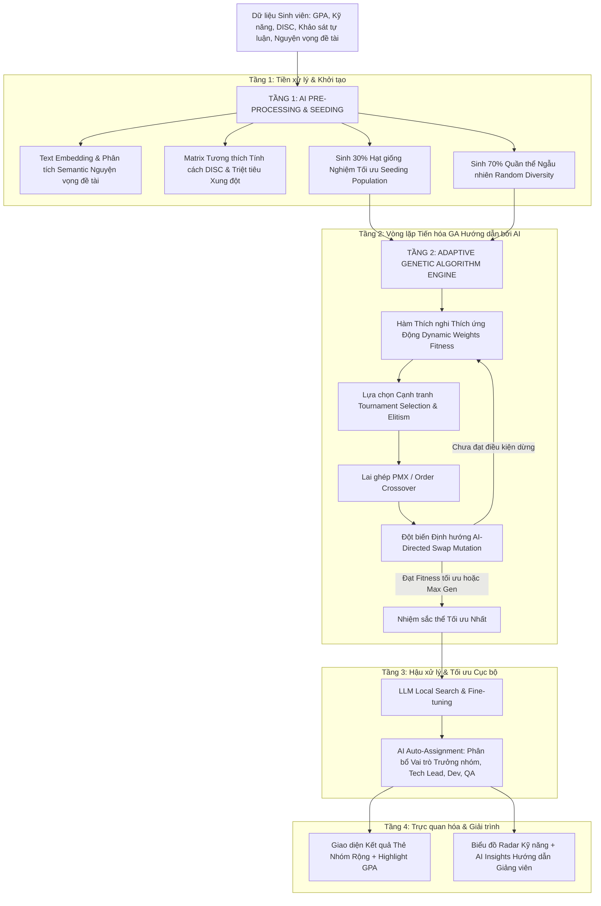

# KẾ HOẠCH NÂNG CẤP GIẢI THUẬT DI TRUYỀN (GA) KẾT HỢP TRÍ TUỆ NHÂN TẠO (AI) TRONG PHÂN CHIA NHÓM SINH VIÊN TỐI ƯU

> **Hệ thống**: NOVIARA – Phân nhóm sinh viên thông minh  
> **Tài liệu**: Kế hoạch kỹ thuật & Kiến trúc giải pháp (Technical Plan & Solution Architecture)  
> **Định dạng**: Markdown (.md)  
> **Trạng thái**: Đề xuất nâng cấp (v2.0)  

---

## MỤC LỤC
1. [Bối cảnh & Đánh giá Rà soát Giao diện Hiện tại](#1-bối-cảnh--đánh-giá-rà-soát-giao-diện-hiện-tại)
2. [Hạn chế của Giải thuật Di truyền (GA) Truyền thống](#2-hạn-chế-của-giải-thuật-di-truyền-ga-truyền-thống)
3. [Tầm nhìn & Mục tiêu Nâng cấp GA + AI](#3-tầm-nhìn--mục-tiêu-nâng-cấp-ga--ai)
4. [Kiến trúc Tổng thể: Hybrid Neuro-Genetic & LLM-Guided Optimization](#4-kiến-trúc-tổng-thể-hybrid-neuro-genetic--llm-guided-optimization)
5. [Chi tiết 4 Trụ cột Nâng cấp Giải thuật GA sử dụng AI](#5-chi-tiết-4-trụ-cột-nâng-cấp-giải-thuật-ga-sử-dụng-ai)
   - [Trụ cột 1: Khởi tạo Quần thể Thông minh (AI-Guided Seeded Initialization)](#trụ-cột-1-khởi-tạo-quần-thể-thông-minh-ai-guided-seeded-initialization)
   - [Trụ cột 2: Hàm Thích nghi Động Đa Mục tiêu (Adaptive Cognitive Fitness Function)](#trụ-cột-2-hàm-thích-nghi-động-đa-mục-tiêu-adaptive-cognitive-fitness-function)
   - [Trụ cột 3: Toán tử Di truyền Định hướng AI (AI-Directed Mutation & Crossover)](#trụ-cột-3-toán-tử-di-truyền-định-hướng-ai-ai-directed-mutation--crossover)
   - [Trụ cột 4: Hậu xử lý & Tự động Phân bổ Vai trò (AI Post-Processing & Role Assignment)](#trụ-cột-4-hậu-xử-lý--tự-động-phân-bổ-vai-trò-ai-post-processing--role-assignment)
6. [Thiết kế Kỹ thuật Backend & Pipeline Tích hợp](#6-thiết-kế-kỹ-thuật-backend--pipeline-tích-hợp)
7. [Cơ chế Dự phòng (Fallback) & Tối ưu Chi phí / Tốc độ](#7-cơ-chế-dự-phòng-fallback--tối-ưu-chi-phí--tốc-độ)
8. [Bộ Tiêu chí Đánh giá & Thực nghiệm Benchmark](#8-bộ-tiêu-chí-đánh-giá--thực-nghiệm-benchmark)
9. [Lộ trình Triển khai Chi tiết (Roadmap 4 Giai đoạn)](#9-lộ-trình-triển-khai-chi-tiết-roadmap-4-giai-đoạn)

---

## 1. BỐI CẢNH & ĐÁNH GIÁ RÀ SOÁT GIAO DIỆN HIỆN TẠI

Hệ thống **NOVIARA** đã hoàn thiện các khâu chuẩn hóa giao diện người dùng và nâng cao trải nghiệm thực tế cho Giảng viên và Sinh viên:

### 1.1. Kết quả Rà soát Giao diện (UI Audit)
- **Cấu trúc Điều hướng & Sidebar**:
  - Gộp thành công 2 mục rời rạc thành một nhóm Dropdown accordion thống nhất: **"Sinh viên & Lớp khảo sát"**, bao gồm 2 mục con: *Danh sách Sinh viên* (có badge đếm sĩ số) và *Lớp học & Khảo sát DISC* (có badge DISC).
  - Trạng thái đóng/mở mượt mà, tự động nhận diện và mở rộng khi người dùng đang ở một trong hai màn hình tương ứng.
  - Phân tách rõ ràng giữa phân hệ Giảng viên/Admin và Cổng tra cứu Sinh viên (Student Portal).
- **Thanh Header Cố định (Fixed Sticky Header)**:
  - Header được ghim cố định ở đỉnh màn hình (`sticky top-0 z-30 backdrop-blur-md`), loại bỏ hoàn toàn hiện tượng nhảy cuộn hoặc mất nút thao tác khi cuộn trang dài.
  - Đã loại bỏ nút Đăng xuất thừa ở Sidebar để tránh người dùng bấm nhầm; tập trung nút Đăng xuất tại góc phải Header.
  - Nút logo/thương hiệu tự động quay về trang chủ phù hợp với vai trò người dùng hiện tại mà không tạo xung đột điều hướng.
- **Khung Thẻ Nhóm & Hiển thị Điểm GPA**:
  - Container chính được mở rộng tối đa lên tới `max-w-[1600px]`, bố cục lưới chuyển đổi linh hoạt: 2 cột rộng rãi trên màn hình laptop/desktop tiêu chuẩn (`md:grid-cols-2 2xl:grid-cols-3 gap-6`), giúp thẻ nhóm có độ rộng từ 480px – 620px thay vì bị bó hẹp trong 3 cột nhỏ hẹp trước đây.
  - **Hiển thị GPA nổi bật**: Điểm GPA được tách thành một Badge độc lập, không còn bị cắt cụt dấu ba chấm (`...`). Hệ thống tự động phân loại màu sắc trực quan:
    - `⭐ GPA >= 3.6`: Badge xanh ngọc viền nổi (Emerald) kèm ngôi sao vinh danh sinh viên điểm cao xuất sắc.
    - `GPA 3.2 – 3.59`: Badge xanh lam (Blue) dành cho học lực Giỏi/Khá cao.
    - `GPA 2.5 – 3.19`: Badge xám thanh lịch (Slate) cho mức độ cân bằng.
    - `GPA < 2.5`: Badge hổ phách (Amber).
  - Tự động gắn nhãn **"⭐ Điểm cao nhất: X.X"** ngay tại tiêu đề danh sách thành viên nhóm, giúp Giảng viên nhận diện ngay lập tức ai là nhân tố học lực vượt trội trong từng nhóm.
- **Biểu đồ Radar & Giải thích AI (Cognitive Synergy)**:
  - Khắc phục triệt để lỗi tràn màn hình ngang bằng thuộc tính `overflow-x: clip`.
  - Biểu đồ mạng nhện 6 trục kỹ năng (`Frontend`, `Backend`, `Database`, `UI/UX`, `QA/Test`, `DevOps`) co giãn thích ứng 100% chiều rộng khung hiển thị.
  - Nút phân tích chuyên sâu với Gemini AI hoạt động ổn định, cung cấp các gợi ý sư phạm và cảnh báo rủi ro hợp tác nhóm.
- **Quản lý Khoa & Đơn vị đào tạo**:
  - Đồng bộ trực tiếp với cơ sở dữ liệu SQLite (`NOVIARA.db`), cho phép Giảng viên thêm, sửa, xóa mã khoa và tiền tố mã lớp tức thì mà không cần hardcode.

---

## 2. HẠN CHẾ CỦA GIẢI THUẬT DI TRUYỀN (GA) TRUYỀN THỐNG

Trong phiên bản hiện tại, thuật toán phân nhóm hoạt động thuần túy dựa trên GA cổ điển:
1. **Khởi tạo ngẫu nhiên (Pure Random Initialization)**: Các cá thể trong quần thể ban đầu được tạo bằng các hoán vị (permutation) ngẫu nhiên của danh sách sinh viên. Điều này khiến GA mất rất nhiều thế hệ (generations) chỉ để loại bỏ các nghiệm hoàn toàn phi thực tế.
2. **Trọng số hàm mục tiêu cố định (Fixed Heuristic Weights)**:
   $$\text{Fitness} = w_1 \cdot \text{SkillBalance} + w_2 \cdot \text{DiscDiversity} + w_3 \cdot \text{GpaBalance} - \text{Penalty}$$
   Các trọng số $w_1, w_2, w_3$ hiện tại là hằng số cố định, không linh hoạt theo từng đặc thù môn học (ví dụ: Đồ án công nghệ phần mềm đòi hỏi độ phủ kỹ năng rất cao, trong khi Khởi nghiệp đổi mới sáng tạo lại đòi hỏi đa dạng tính cách DISC và khả năng thuyết trình).
3. **Mù thông tin ngữ nghĩa (Lack of Semantic Awareness)**: Thuật toán chỉ hiểu các con số (GPA 3.2, Level 4), hoàn toàn không hiểu được:
   - Sở thích đề tài và định hướng nghề nghiệp của sinh viên (ví dụ: SV muốn làm đề tài AI/Machine Learning hay E-commerce).
   - Câu trả lời tự luận khảo sát về văn hóa làm việc (thức khuya hay dậy sớm, thích làm việc offline hay online).
   - Tương tác tính cách tiềm ẩn giữa hai cá nhân quá mạnh (2 bạn cùng nhóm tính cách High-D có thể tranh quyền lãnh đạo dẫn đến bất hòa).
4. **Đột biến ngẫu nhiên không định hướng (Blind Mutation)**: Phép đột biến Swap ngẫu nhiên hai sinh viên bất kỳ thường phá vỡ cấu trúc tốt của các nhóm khác, làm chậm tốc độ hội tụ (convergence).

---

## 3. TẦM NHÌN & MỤC TIÊU NÂNG CẤP GA + AI

Xây dựng mô hình **Hybrid Neuro-Genetic / LLM-Guided Evolutionary Optimization** (Giải thuật Di truyền Tiến hóa kết hợp Trí tuệ Nhân tạo Hướng dẫn):

- **Tận dụng sức mạnh cốt lõi của GA**: Khả năng tìm kiếm toàn cục (Global Search), vượt qua các cực trị địa phương (Local Optima), tối ưu hóa tổ hợp đa biến số với hàng triệu hoán vị.
- **Tận dụng sức mạnh cốt lõi của AI / LLM**: Khả năng hiểu ngữ nghĩa ngôn ngữ tự nhiên (NLP/Embeddings), đánh giá tương tác tâm lý – xã hội, điều chỉnh siêu tham số thích nghi theo thời gian thực và sinh phân bổ vai trò chuẩn xác.
- **Mục tiêu định lượng**:
  - Rút ngắn thời gian hội tụ GA từ 40% – 60% (giảm số thế hệ cần chạy để đạt fitness > 90%).
  - Tăng chỉ số hài hòa nhóm (Team Synergy Index) lên trên 88%.
  - Triệt tiêu 100% xung đột thiếu kỹ năng cốt lõi (100% nhóm có đủ ít nhất 1 Frontend, 1 Backend, 1 Database/DevOps).

---

## 4. KIẾN TRÚC TỔNG THỂ: HYBRID NEURO-GENETIC & LLM-GUIDED OPTIMIZATION

Mô hình hoạt động theo quy trình 4 tầng khép kín:



---

## 5. CHI TIẾT 4 TRỤ CỘT NÂNG CẤP GIẢI THUẬT GA SỬ DỤNG AI

### Trụ cột 1: Khởi tạo Quần thể Thông minh (AI-Guided Seeded Initialization)
- **Vấn đề**: GA thuần túy sinh 100% cá thể ngẫu nhiên. Trong không gian nghiệm tổ hợp của $N=60$ sinh viên chia thành 12 nhóm, số cách chia nhóm là cực lớn ($\approx 10^{65}$), dẫn đến việc quần thể ban đầu chứa toàn các giải pháp rất kém.
- **Giải pháp Nâng cấp AI**:
  1. **Tách cụm Kỹ năng Hạt giống (Skill Anchor Clustering)**:
     - Sử dụng thuật toán phân cụm có ràng buộc (Constrained Clustering) để nhóm các ứng viên có kỹ năng then chốt (ví dụ: các lập trình viên Fullstack/Backend giỏi nhất hoặc các sinh viên có tố chất Leader nhóm D).
     - Đưa đều mỗi nhân tố hạt giống vào từng nhóm trong $K$ nhóm.
  2. **Semantic Similarity Matching bằng Text Embeddings**:
     - Sinh viên thường có các nguyện vọng đề tài tự do (ví dụ: *"Muốn làm đề tài Website bán hàng bằng React/NodeJS"*, *"Muốn nghiên cứu ứng dụng AI trên thiết bị di động"*).
     - Sử dụng mô hình Text Embedding (Gemini Embedding / Sentence-Transformers) tính khoảng cách Cosine giữa các nguyện vọng.
  3. **Tỉ lệ Khởi tạo Quần thể**:
     - **30% Cá thể Hạt giống (Smart Seeds)**: Được cấu trúc sơ bộ từ phân cụm AI, đảm bảo mỗi nhóm đã có sẵn khung nhân sự cơ bản.
     - **70% Cá thể Ngẫu nhiên (Random Diversity)**: Đảm bảo tính đa dạng sinh học, ngăn chặn hiện tượng hội tụ sớm (Premature Convergence) vào cực trị địa phương.

---

### Trụ cột 2: Hàm Thích nghi Động Đa Mục tiêu (Adaptive Cognitive Fitness Function)
- **Vấn đề**: Các môn học khác nhau hoặc từng đợt phân nhóm đòi hỏi mục tiêu khác nhau. Trọng số cố định khiến kết quả không bám sát yêu cầu môn học.
- **Công thức Mới – Hàm Thích nghi Nhận thức Động (Dynamic Cognitive Fitness)**:

$$\text{Fitness}(C) = \alpha \cdot F_{\text{skill}}(C) + \beta \cdot F_{\text{disc}}(C) + \gamma \cdot F_{\text{gpa}}(C) + \delta \cdot F_{\text{topic}}(C) - \sum \text{Penalty}$$

Trong đó:
1. **$F_{\text{skill}}(C)$ – Độ phủ & Cân bằng Kỹ năng (Skill Coverage)**:
   - Đánh giá khả năng tự lực cánh sinh của nhóm trên 6 năng lực (Frontend, Backend, Database, UI/UX, QA, DevOps).
   - Nhóm có đầy đủ cả 3 vai trò lõi (FE, BE, DB) nhận điểm thưởng cao.
2. **$F_{\text{disc}}(C)$ – Độ Tương tác & Đa dạng Tâm lý DISC**:
   - Sử dụng ma trận tương hợp DISC (Synergy Matrix):
     - Một nhóm lý tưởng có 1 nhân tố **D** (định hướng, quyết đoán) làm Leader, kết hợp với các bạn **I** (kết nối, giao tiếp), **S** (hỗ trợ, kiên định) và **C** (tỉ mỉ, kiểm thử chất lượng).
     - Phạt nặng nhóm có 3 hoặc 4 bạn cùng tính cách **High-D** vì nguy cơ xung đột cái tôi rất cao.
     - Phạt nhóm hoàn toàn không có ai là **D** hoặc **I** (nguy cơ nhóm thụ động, không có tiếng nói chung).
3. **$F_{\text{gpa}}(C)$ – Cân bằng Năng lực Học tập (GPA Equity)**:
   - Giảm thiểu phương sai GPA giữa các nhóm: Tránh hiện tượng tạo ra "nhóm siêu sao" (toàn GPA 3.8 – 4.0) và "nhóm yếu kém" (toàn GPA < 2.2).
   - Đảm bảo mỗi nhóm đều có ít nhất một bạn học lực Giỏi/Xuất sắc để dìu dắt các bạn còn lại.
4. **$F_{\text{topic}}(C)$ – Tương đồng Định hướng Đề tài (Topic Cohesion)**:
   - Đánh giá độ đồng thuận về đề tài/công nghệ mà sinh viên mong muốn làm việc.
5. **Cơ chế Điều chỉnh Trọng số Tự động bởi AI (AI Dynamic Weight Tuning)**:
   - Giảng viên chọn chế độ môn học: *"Đồ án Kỹ thuật Công nghệ"*, *"Môn Quản trị Dự án / Kỹ năng mềm"*, hoặc *"Khởi nghiệp & Hackathon"*.
   - AI tự động cấu hình bộ trọng số $(\alpha, \beta, \gamma, \delta)$ tối ưu cho ngữ cảnh đó.

---

### Trụ cột 3: Toán tử Di truyền Định hướng AI (AI-Directed Mutation & Crossover)
- **Vấn đề**: Toán tử hoán vị ngẫu nhiên (Swap Mutation) của GA thông thường đổi chỗ 2 sinh viên ngẫu nhiên bất kể việc đổi chỗ đó có giải quyết được điểm nghẽn của nhóm hay không.
- **Giải pháp Đột biến Thông minh (AI-Directed Targeted Mutation)**:
  1. **Bước 1 – Định vị Điểm Yếu (Bottleneck Detection)**:
     - Thuật toán quét nhanh để tìm nhóm có điểm Fitness thấp nhất trong nhiễm sắc thể (ví dụ: Nhóm 3 đang thiếu kỹ năng Backend; Nhóm 7 đang thừa 3 bạn Backend nhưng thiếu Frontend).
  2. **Bước 2 – Đột biến Hướng đích (Targeted Swap)**:
     - Thay vì chọn ngẫu nhiên, thuật toán ưu tiên hoán đổi 1 bạn Backend thừa ở Nhóm 7 sang Nhóm 3 để đổi lấy 1 bạn Frontend.
     - Xác suất đột biến thông minh được áp dụng ở mức 65%, trong khi 35% vẫn giữ đột biến ngẫu nhiên thuần túy để duy trì tính ngẫu nhiên khám phá không gian tìm kiếm.
  3. **Toán tử Lai ghép Giữ khối Kỹ năng (Block-Preserving PMX Crossover)**:
     - Kế thừa các khối nhóm con (Sub-teams) đã đạt độ thỏa mãn cao (> 92%) giữa thế hệ bố mẹ mà không bị xé lẻ.

---

### Trụ cột 4: Hậu xử lý & Tự động Phân bổ Vai trò (AI Post-Processing & Role Assignment)
- Sau khi GA tìm được phương án chia nhóm có điểm Fitness toàn cục cao nhất, tầng AI sẽ thực hiện hoàn thiện:
  1. **Chỉ định Trưởng nhóm Tối ưu (Leader Recommendation)**:
     - Đánh giá dựa trên kết hợp: Tính cách DISC (ưu tiên D hoặc D-I), Điểm kỹ năng quản lý, Điểm GPA và Lịch sử phản hồi.
     - Cho phép Giảng viên đổi Trưởng nhóm linh hoạt bằng 1 cú nhấp chuột trên giao diện (như tính năng đã tích hợp trên UI).
  2. **Gán vai trò Chuyên môn hóa**:
     - Đề xuất vai trò tự động cho từng thành viên: *Product Owner, Tech Lead, Frontend Developer, Backend Developer, QA/Tester*.
  3. **Sinh Báo cáo & Lộ trình Hành động Cá nhân hóa**:
     - Sử dụng Gemini AI sinh bản tóm tắt giải trình vì sao nhóm này được ghép cùng nhau.
     - Cảnh báo trước cho Giảng viên các rủi ro tiềm ẩn (ví dụ: *"Nhóm 2 kỹ năng kỹ thuật rất mạnh nhưng thiếu nhân tố I, Giảng viên cần nhắc nhở nhóm tăng cường họp trực tiếp để tránh hiểu lầm"*).

---

## 6. THIẾT KẾ KỸ THUẬT BACKEND & PIPELINE TÍCH HỢP

### 6.1. Cấu trúc Module Python Backend (`backend/`)
```
backend/
├── main.py                     # API FastAPI RESTful & WebSocket Endpoints
├── database.py                 # SQLite ORM & Schema Engine
├── ga/
│   ├── engine.py               # Lõi Genetic Algorithm (Population, Selection, Crossover)
│   ├── fitness.py              # Đánh giá Fitness đa mục tiêu (Skill, DISC, GPA, Topic)
│   ├── operators.py            # Toán tử lai ghép PMX, Mutation ngẫu nhiên & Định hướng AI
│   └── seed_generator.py       # Khởi tạo quần thể hạt giống thông minh bằng Clustering
├── ai/
│   ├── embedding_service.py    # Vector hóa nguyện vọng đề tài & khảo sát tự luận
│   ├── disc_analyzer.py        # Ma trận tương tác tâm lý học nhóm
│   └── gemini_advisor.py       # Gọi Gemini AI sinh giải thích & phân vai trò
└── models.py                   # Pydantic Schemas & DTOs
```

### 6.2. Pipeline Xử lý Bất đồng bộ (Async Job Execution)
1. **Frontend Request**: Giảng viên bấm *"Tạo phân nhóm GA"* trên giao diện `GroupingWizard.tsx`.
2. **FastAPI Background Worker**:
   - Khởi chạy luồng chạy nền riêng biệt (`BackgroundTasks` hoặc `Celery / Redis`).
   - Truyền tải tiến trình từng thế hệ (Generation 1 -> 100) qua Server-Sent Events (SSE) hoặc WebSocket về thanh tiến trình trên giao diện.
3. **Lưu trữ & Snapshot**:
   - Mọi phiên phân nhóm được lưu snapshot đầy đủ vào bảng `grouping_sessions` và `group_members` trong SQLite để có thể xem lại lịch sử phiên bản bất kỳ lúc nào.

---

## 7. CƠ CHẾ DỰ PHÒNG (FALLBACK) & TỐI ƯU CHI PHÍ / TỐC ĐỘ

Để đảm bảo hệ thống hoạt động tin cậy trong môi trường thực tế tại trường đại học:
- **Cơ chế Offline-First / Graceful Degradation**:
  - Nếu mất kết nối Internet hoặc API Gemini đạt ngưỡng giới hạn tần suất (Rate Limit 429), hệ thống tự động chuyển sang chế độ **Pure GA Fallback**.
  - Toàn bộ thuật toán tối ưu hóa di truyền vẫn chạy 100% bình thường tại máy chủ cục bộ bằng thư viện Python nguyên bản mà không bị gián đoạn.
- **Tối ưu Chi phí API (Zero / Low-Cost Optimization)**:
  - Chỉ gọi Gemini AI ở 2 thời điểm thiết yếu:
    1. Tiền xử lý vector hóa dữ liệu tự luận (chạy 1 lần duy nhất khi nhập danh sách sinh viên).
    2. Sinh văn bản giải thích nhóm (chỉ chạy cho phương án tốt nhất sau khi GA đã hội tụ, không gọi trong vòng lặp tiến hóa).
  - Sử dụng mô hình `gemini-1.5-flash` có tốc độ xử lý siêu nhanh (dưới 1.5 giây) và hạn mức miễn phí dồi dào.

---

## 8. BỘ TIÊU CHÍ ĐÁNH GIÁ & THỰC NGHIỆM BENCHMARK

Để chứng minh tính ưu việt của giải pháp nâng cấp trong báo cáo khoa học và đồ án:
1. **So sánh với 3 phương pháp Baseline**:
   - **Random Baseline**: Phân chia ngẫu nhiên hoàn toàn.
   - **Greedy Baseline**: Thuật toán tham lam phân bổ lần lượt từng sinh viên điểm cao và kỹ năng mạnh vào từng nhóm.
   - **Standard GA**: Thuật toán di truyền truyền thống không có AI seeding và đột biến hướng đích.
   - **Hybrid AI-GA (Giải pháp Mới)**.
2. **Các chỉ số đo lường (Metrics)**:
   - **Overall Fitness Score (%)**: Điểm thích nghi trung bình qua 10 lần chạy với các seed khác nhau.
   - **Tốc độ hội tụ (Convergence Speed)**: Số thế hệ trung bình để đạt ngưỡng Fitness > 90%.
   - **Tỉ lệ vi phạm ràng buộc (Hard Constraint Violations)**: Số nhóm thiếu kỹ năng sống còn.
   - **Phương sai GPA (GPA Variance)**: Mức độ đồng đều học lực giữa các nhóm.
   - **Thời gian chạy thực tế (Execution Time)**: Tính theo giây trên tập dữ liệu 40, 80, 120 sinh viên.

---

## 9. LỘ TRÌNH TRIỂN KHAI CHI TIẾT (ROADMAP 4 GIAI ĐOẠN)

| Giai đoạn | Thời gian | Trọng tâm công việc | Sản phẩm đầu ra |
| :--- | :--- | :--- | :--- |
| **Giai đoạn 1** | Tuần 1 – 2 | Xây dựng module `seed_generator.py` & Tích hợp ma trận tương thích DISC | Thuật toán sinh 30% quần thể hạt giống; Unit test kiểm tra tính toàn vẹn |
| **Giai đoạn 2** | Tuần 3 – 4 | Cài đặt hàm thích nghi động đa mục tiêu & Toán tử đột biến hướng đích AI-Directed Mutation | Module `ga/fitness.py` và `ga/operators.py` hoàn chỉnh; benchmark sơ bộ |
| **Giai đoạn 3** | Tuần 5 – 6 | Tích hợp xử lý nền bất đồng bộ FastAPI + SSE Realtime Progress trên giao diện | Giao diện hiển thị tiến trình tiến hóa theo thời gian thực |
| **Giai đoạn 4** | Tuần 7 – 8 | Thực nghiệm đo đạc chỉ số với 3 baseline (Random, Greedy, Pure GA) & Đóng gói báo cáo | Bảng số liệu benchmark, biểu đồ hội tụ so sánh và bản nghiệm thu hoàn chỉnh |

---

> **Kết luận**: Kế hoạch nâng cấp GA kết hợp AI mở ra bước tiến quan trọng cho NOVIARA, biến hệ thống từ một công cụ phân nhóm tự động cơ bản thành một **Nền tảng Tối ưu hóa Tổ chức Đội nhóm Thông minh (Intelligent Team Formation Platform)**, mang lại giá trị thực tiễn cao cho công tác đào tạo đại học.
